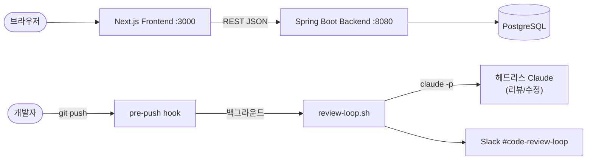
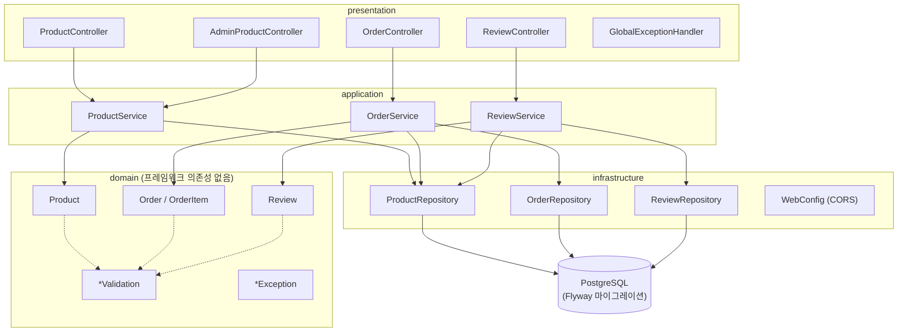
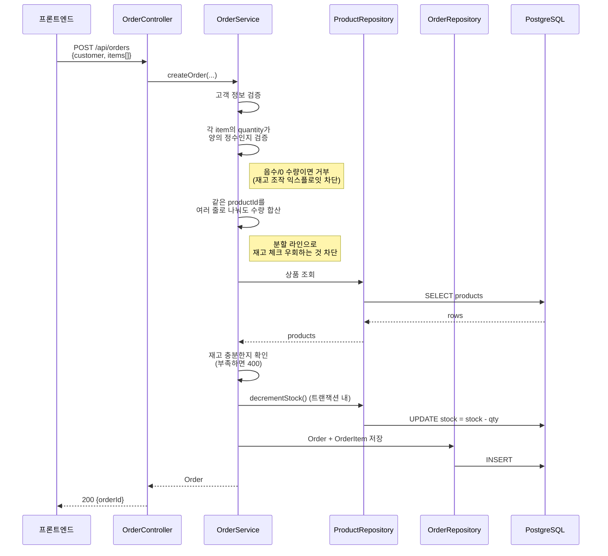
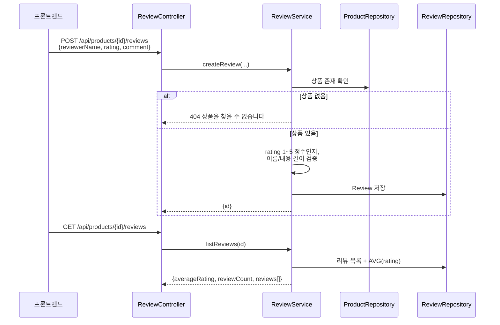

# 쇼핑몰 (shop)

Next.js 프론트엔드 + Spring Boot 백엔드로 만든 미니 쇼핑몰. 상품 목록/상세, 장바구니, 주문, 리뷰/평점까지 핵심 기능을 구현했고, push할 때마다 자동으로 도는 AI 코드 리뷰 봇이 붙어 있습니다.

- 프론트엔드 상세: [frontend/README.md](frontend/README.md) (없으면 `npm --prefix frontend run dev`)
- 백엔드 상세: [backend/README.md](backend/README.md)
- 리뷰 봇 상세: [scripts/README.md](scripts/README.md)
- 개발 과정/트러블슈팅 기록: [PORTFOLIO.md](PORTFOLIO.md)

## 빠른 시작

```bash
# 1) 로컬 Postgres (Docker 불필요)
npx prisma dev --db-port 51214

# 2) 백엔드 (:8080)
cd backend && ./gradlew bootRun   # Windows: gradlew.bat bootRun

# 3) 프론트엔드 (:3000)
npm --prefix frontend run dev
```

## 시스템 아키텍처



프론트엔드와 백엔드는 완전히 분리된 두 개의 앱입니다 — 같은 저장소 안에서 `frontend/`와 `backend/` 폴더로만 나뉘어 있고, 서로 HTTP REST API로만 통신합니다(프론트가 백엔드 DB에 직접 접근하지 않음). 회원가입/로그인은 JWT 기반 인증이며, 관리자 API와 주문 생성(`POST /api/orders`)은 인증(및 역할)을 요구합니다.

## 백엔드 아키텍처 — 4계층 DDD



- **domain**: 검증 규칙(`ProductValidation`, `OrderValidation`, `ReviewValidation`)과 커스텀 예외만 있고, Spring/JPA에 대한 의존이 없습니다.
- **application**: 유스케이스 하나당 서비스 하나(`ProductService`/`OrderService`/`ReviewService`) — 하나의 거대한 서비스로 뭉치지 않도록 분리.
- **infrastructure**: Spring Data JPA 리포지토리, Flyway로 관리되는 스키마.
- **presentation**: REST 컨트롤러 + `GlobalExceptionHandler`가 도메인 예외를 HTTP 상태 코드로 매핑(`ValidationException`→400, `ProductNotFoundException`→404).

## 핵심 로직 1 — 주문 생성 (재고 조작 방어 포함)

이 흐름은 AI 코드 리뷰(React/TypeScript/DB/보안 4개 에이전트)가 독립적으로 같은 취약점을 찾아낸 뒤 하드닝된 버전입니다.



`stock >= 0` DB CHECK 제약이 마지막 방어선입니다 — 애플리케이션 검증을 우회하는 코드가 나중에 실수로 들어와도 DB가 막습니다.

## 핵심 로직 2 — 리뷰/평점



## 자동화 — push하면 자동으로 도는 코드 리뷰 봇

```mermaid
sequenceDiagram
  participant Dev as 개발자
  participant Hook as pre-push hook
  participant Loop as review-loop.sh
  participant AI as claude -p (헤드리스)
  participant Slack as Slack

  Dev->>Hook: git push
  Hook-->>Dev: push는 즉시 진행 (안 막힘)
  Hook->>Loop: 백그라운드로 실행
  loop 최대 3라운드
    Loop->>AI: 이번 push의 diff 리뷰
    AI-->>Loop: APPROVED 또는<br/>CHANGES_NEEDED + 지적사항
    Loop->>Slack: 리뷰 결과 게시
    alt 문제 있고 라운드 남음
      Loop->>AI: 지적사항 직접 고치고 커밋
      AI-->>Loop: 수정 요약
      Loop->>Slack: 수정 결과 게시
    else 승인됨 or 3라운드 소진
      Loop->>Slack: 최종 결과 게시 후 종료
    end
  end
```

`claude` CLI 로그인과 Slack Incoming Webhook 설정이 필요합니다 — 자세한 건 [scripts/README.md](scripts/README.md) 참고.
