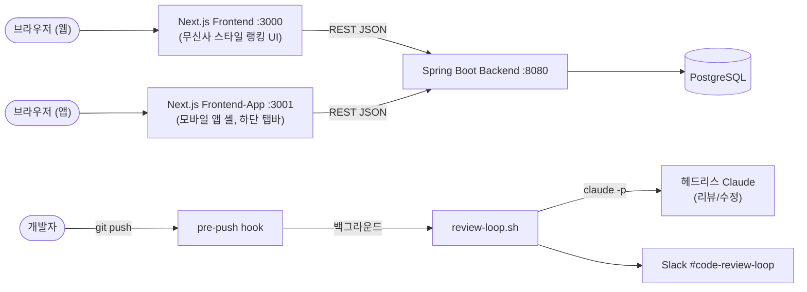
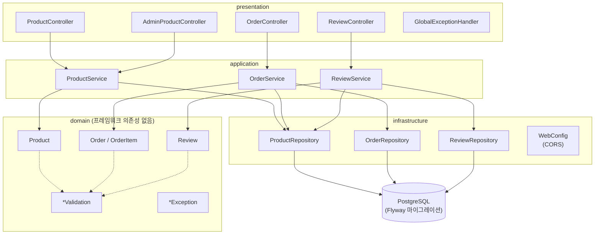
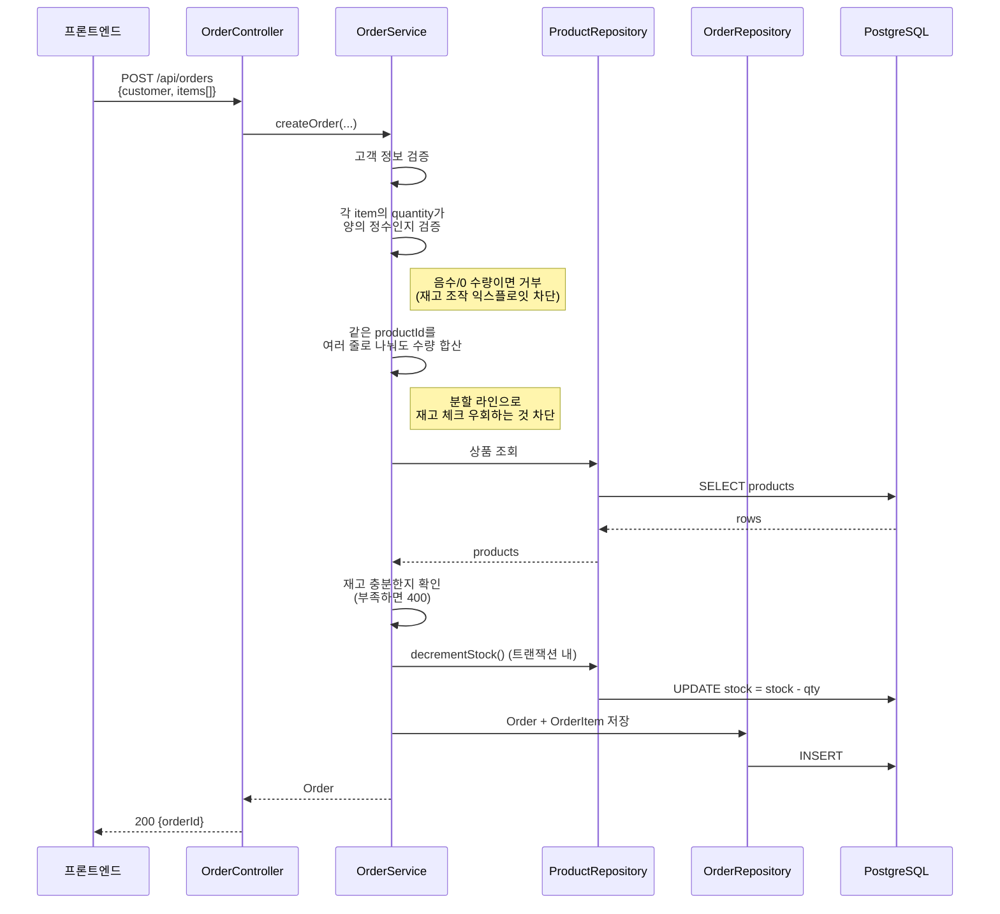
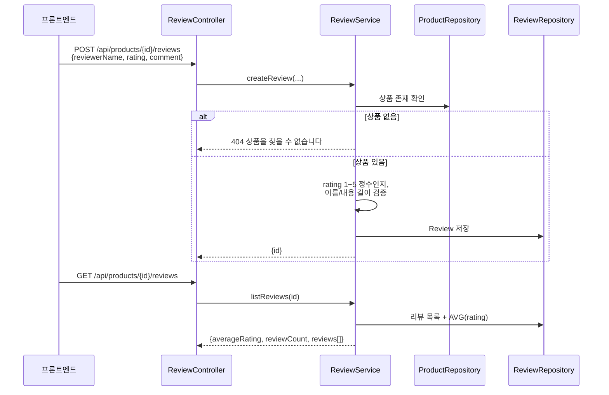
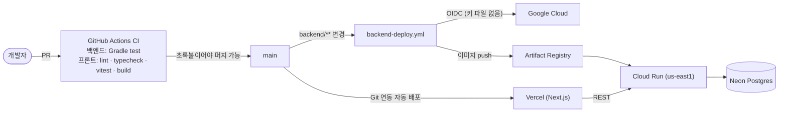

# 쇼핑몰 (shop)

Spring Boot 백엔드 + Next.js 프론트엔드(웹/앱 각각 별도 프로젝트)로 만든 미니 쇼핑몰. 상품 목록/상세, 장바구니, 주문, 리뷰/평점 핵심 기능을 구현했고, push할 때마다 자동으로 도는 AI 코드 리뷰 봇이 붙어 있습니다.

- 웹 프론트엔드 상세: [frontend/README.md](frontend/README.md) (없으면 `npm --prefix frontend run dev`, :3000)
- 앱(모바일) 프론트엔드: `npm --prefix frontend-app run dev` (:3001) — 웹과 코드 공유 없는 완전 별도 Next.js 프로젝트, 같은 백엔드를 봅니다
- 백엔드 상세: [backend/README.md](backend/README.md)
- 리뷰 봇 상세: [scripts/README.md](scripts/README.md)
- 개발 과정/트러블슈팅 기록: [PORTFOLIO.md](PORTFOLIO.md)

## 빠른 시작

```bash
# 1) 로컬 Postgres (Docker 불필요)
npx prisma dev --db-port 51214

# 2) 백엔드 (:8080)
cd backend && ./gradlew bootRun   # Windows: gradlew.bat bootRun

# 3) 웹 프론트엔드 (:3000)
npm --prefix frontend run dev

# 4) 앱(모바일) 프론트엔드 (:3001, 선택)
npm --prefix frontend-app run dev
```

## 시스템 아키텍처



프론트엔드와 백엔드는 완전히 분리된 두 개의 앱입니다 — 같은 저장소 안에서 `frontend/`와 `backend/` 폴더로만 나뉘어 있고, 서로 HTTP REST API로만 통신합니다(프론트가 백엔드 DB에 직접 접근하지 않음). 회원가입/로그인은 JWT 기반 인증이며, 관리자 API와 주문 생성(`POST /api/orders`)은 인증(및 역할)을 요구합니다.

## 백엔드 아키텍처 — 4계층 DDD



- **domain**: 검증 규칙(`ProductValidation`, `OrderValidation`, `ReviewValidation`)과 커스텀 예외만 있고, Spring/JPA에 대한 의존이 없습니다.
- **application**: 유스케이스 하나당 서비스 하나(`ProductService`/`OrderService`/`ReviewService`) — 하나의 거대한 서비스로 뭉치지 않도록 분리.
- **infrastructure**: Spring Data JPA 리포지토리, Flyway로 관리되는 스키마, `WebConfig`(CORS).
- **presentation**: REST 컨트롤러 + `GlobalExceptionHandler`가 도메인 예외를 HTTP 상태 코드로 매핑(`ValidationException`→400, `ProductNotFoundException`→404).

## 인증 (JWT)

회원가입(`POST /api/auth/register`)과 로그인(`POST /api/auth/login`)은 JWT(2시간 만료) 기반입니다. 역할은 `ADMIN`/`SELLER`(고정 시드 계정, 셀프 가입 불가)와 `USER`(셀프 가입) 세 가지예요.

- `/api/admin/products/**`는 `ADMIN`/`SELLER`만, 주문 생성(`POST /api/orders`)은 로그인한 사용자만 호출할 수 있습니다. 나머지 조회 API는 공개입니다.
- 토큰이 없거나 무효면 401, 역할이 부족하면 403을 반환합니다(프론트가 "로그인 필요"와 "권한 없음"을 구분할 수 있도록 Spring 기본 동작을 커스터마이징).
- 관리자/판매자 시드 계정은 이메일과 비밀번호를 모두 환경변수(`ADMIN_EMAIL`/`ADMIN_PASSWORD`, `SELLER_EMAIL`/`SELLER_PASSWORD`)로만 받습니다. 저장소에는 계정 정보도 기본값도 없고(값이 없으면 계정을 만들지 않음), 운영 값은 Secret Manager에 있습니다.

## 핵심 로직 1 — 주문 생성 (재고 조작 방어 포함)

이 흐름은 AI 코드 리뷰(React/TypeScript/DB/보안 4개 에이전트)가 독립적으로 같은 취약점을 찾아낸 뒤 하드닝된 버전입니다.



`stock >= 0` DB CHECK 제약이 마지막 방어선입니다 — 애플리케이션 검증을 우회하는 코드가 나중에 실수로 들어와도 DB가 막습니다.

## 핵심 로직 2 — 리뷰/평점



## 테스트

- **백엔드**: 컨트롤러별 성공/실패 테스트(`@WebMvcTest` + 서비스 계층 `@MockBean`). 웹 계층만 띄우므로 **실제 DB를 건드리지 않아** CI에서 빠르고 안정적으로 돌아갑니다. 인증이 걸린 API는 실제 `SecurityConfig`를 불러와 401/403/200을 검증합니다. 실제 DB를 쓰는 통합 테스트(Testcontainers)는 아직 없습니다.
- **프론트엔드**: Vitest + React Testing Library(API 클라이언트, 로그인 폼).

```bash
cd backend && ./gradlew test        # Windows: gradlew.bat test
npm --prefix frontend test
```

## CI/CD와 배포

**데모**: https://shop-wheat-two.vercel.app



| 구성 | 서비스 | 비고 |
|---|---|---|
| 프론트엔드 | Vercel (Hobby) | `main` 머지 시 자동 배포, Root Directory `frontend`, `NEXT_PUBLIC_BACKEND_URL`로 백엔드 주소 지정 |
| 백엔드 | Cloud Run (`us-east1`) | Docker 이미지(`backend/Dockerfile`, 멀티스테이지·non-root), 배포 후 스모크 테스트 |
| DB | Neon Postgres | 기동 시 Flyway가 마이그레이션 실행 |
| 시크릿 | GCP Secret Manager | DB 접속 정보, `JWT_SECRET`, `ADMIN_PASSWORD`, `SELLER_PASSWORD` |

- **머지 게이트**: `main`은 보호되어 있고, 백엔드(`test`)·프론트(`build-and-test`) CI가 모두 초록불이어야 머지할 수 있습니다(관리자 포함). CI 워크플로에는 `paths` 필터를 두지 않았습니다 — 필수 체크가 필터에 걸려 아예 실행되지 않으면 GitHub이 그 체크를 영원히 "대기"로 두어 문서만 고친 PR도 머지가 막히기 때문입니다.
- **키 없는 인증**: GitHub Actions는 OIDC로 GCP(Workload Identity Federation)에 인증하며, 이 저장소에서 온 요청만 허용합니다. 서비스 계정 키 파일이 없습니다.
- **무료 한도 유지**: 최소 인스턴스 0 / 최대 2, 요청을 처리하는 동안에만 CPU 할당, Artifact Registry는 최근 이미지 3개만 보관. 요청이 없으면 0대로 줄어 첫 접속이 몇 초 느릴 수 있습니다.
- **리전**: Neon DB가 미국 동부(Ohio)에 있어 Cloud Run도 `us-east1`에 두었습니다(리전이 멀면 쿼리마다 왕복 지연이 쌓임).
- **시크릿 분리**: 저장소에는 로컬 개발용 기본값만 있고, 운영 값은 Secret Manager에서 환경변수로 주입합니다.

최초 1회 설정: Neon 프로젝트 생성 → Cloud Shell에서 `PROJECT_ID=... REGION=us-east1 bash scripts/gcp-setup.sh` (API 활성화, 서비스 계정, WIF, 시크릿 생성) → 출력된 값을 GitHub 저장소 Variables에 등록(`GCP_PROJECT_ID`, `GCP_REGION`, `GCP_DEPLOYER_SERVICE_ACCOUNT`, `GCP_WORKLOAD_IDENTITY_PROVIDER`, `CORS_ALLOWED_ORIGINS`) → Vercel에서 저장소를 가져와 배포.

## 자동화 — push하면 자동으로 도는 코드 리뷰 봇

```mermaid
sequenceDiagram
  participant Dev as 개발자
  participant Hook as pre-push hook
  participant Loop as review-loop.sh
  participant AI as claude -p (헤드리스)
  participant Slack as Slack

  Dev->>Hook: git push
  Hook-->>Dev: push는 즉시 진행 (안 막힘)
  Hook->>Loop: 백그라운드로 실행
  loop 최대 3라운드
    Loop->>AI: 이번 push의 diff 리뷰
    AI-->>Loop: APPROVED 또는<br/>CHANGES_NEEDED + 지적사항
    Loop->>Slack: 리뷰 결과 게시
    alt 문제 있고 라운드 남음
      Loop->>AI: 지적사항 직접 고치고 커밋
      AI-->>Loop: 수정 요약
      Loop->>Slack: 수정 결과 게시
    else 승인됨 or 3라운드 소진
      Loop->>Slack: 최종 결과 게시 후 종료
    end
  end
```

`claude` CLI 로그인과 Slack Incoming Webhook 설정이 필요합니다 — 자세한 건 [scripts/README.md](scripts/README.md) 참고.
